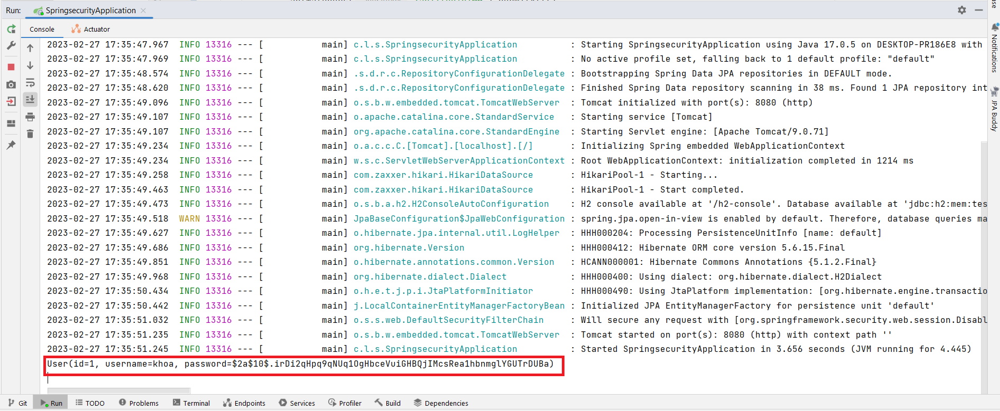
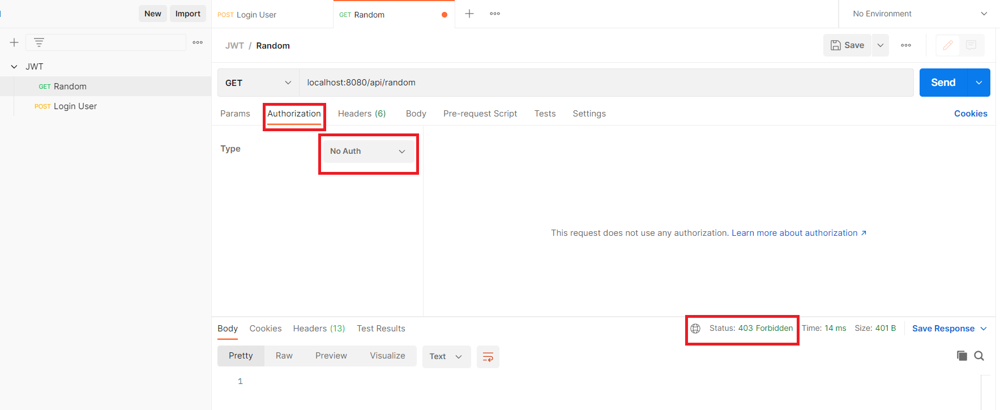
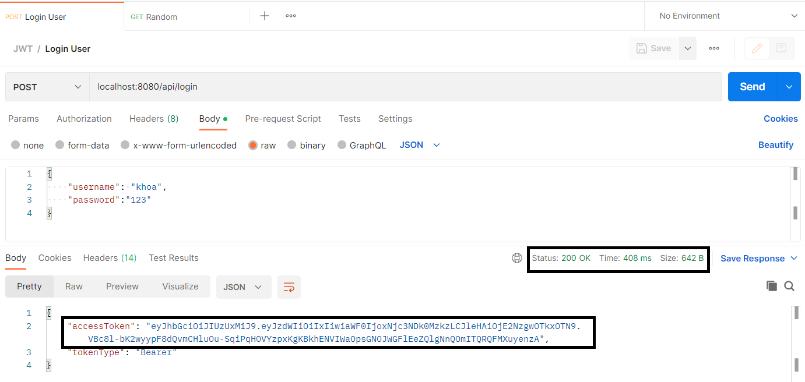
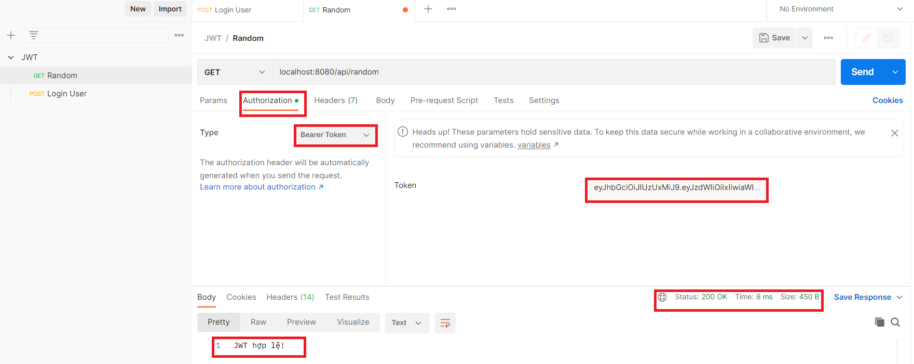
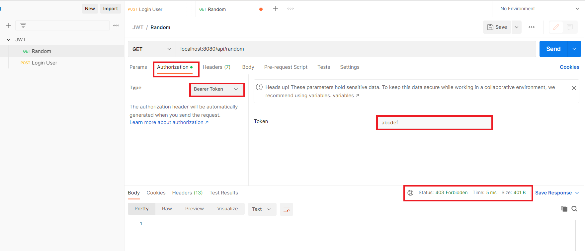

# Spring security and Json Web Token (JWT)

## Setting dependencies in pom.xml file
``` xml
<dependencies>
    <dependency>
        <groupId>org.springframework.boot</groupId>
        <artifactId>spring-boot-starter-data-jpa</artifactId>
    </dependency>
    <dependency>
        <groupId>org.springframework.boot</groupId>
        <artifactId>spring-boot-starter-security</artifactId>
    </dependency>
    <dependency>
        <groupId>org.springframework.boot</groupId>
        <artifactId>spring-boot-starter-thymeleaf</artifactId>
    </dependency>
    <dependency>
        <groupId>org.springframework.boot</groupId>
        <artifactId>spring-boot-starter-web</artifactId>
    </dependency>
    <dependency>
        <groupId>org.thymeleaf.extras</groupId>
        <artifactId>thymeleaf-extras-springsecurity5</artifactId>
    </dependency>
    <dependency>
        <groupId>com.h2database</groupId>
        <artifactId>h2</artifactId>
        <scope>runtime</scope>
    </dependency>
    <dependency>
        <groupId>org.projectlombok</groupId>
        <artifactId>lombok</artifactId>
        <optional>true</optional>
    </dependency>
    <dependency>
        <groupId>org.springframework.boot</groupId>
        <artifactId>spring-boot-starter-test</artifactId>
        <scope>test</scope>
    </dependency>
    <dependency>
        <groupId>org.springframework.security</groupId>
        <artifactId>spring-security-test</artifactId>
        <scope>test</scope>
    </dependency>
</dependencies>
```

### Run Application
* Emulate User table data using CommandLineRunner interface.

```java
@SpringBootApplication
public class SpringsecurityApplication implements CommandLineRunner {

	public static void main(String[] args) {
		SpringApplication.run(SpringsecurityApplication.class, args);
	}
	@Autowired
	UserRepository userRepository;
	@Autowired
	PasswordEncoder passwordEncoder;

	@Override
	public void run(String... args) throws Exception{
		User user = new User();
		user.setUsername("khoa");
		user.setPassword(passwordEncoder.encode("123"));
		userRepository.save(user);
		System.out.println(user);
	}
}
```
* When running the application, the console will log User information.



* When the server is on, API GET request to `http://localhost:8080/api/random` without authentication. Then, the error shows HTTP Error 403 Forbidden.




* To request, we log into the system with `POST /api/login` to get the JWT. Token will be obtained from the accessToken key in Response Body.



* Request API GET /api/random, select `Authorization`, `Type` `Bearer Token`, use the above JWT information and paste it in the `Token` box.


* Assume, input string Token `abcdef` is invalid. Then, the error shows HTTP Error 403 Forbidden.
